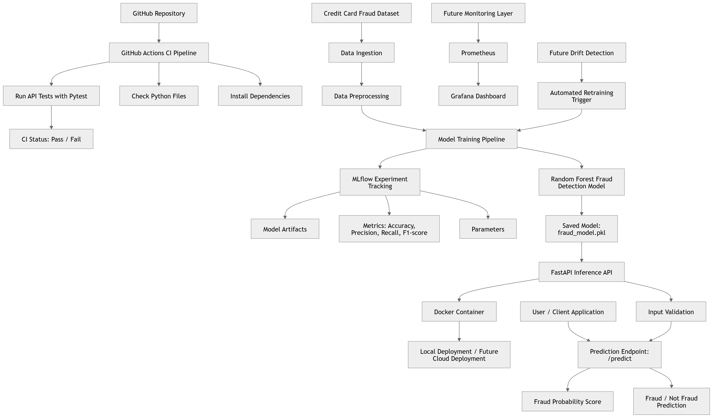

Production-Grade Fraud Detection MLOps Platform

This project is an end-to-end fraud detection system designed to simulate a real-world MLOps workflow, starting from machine learning model training and extending to API serving, experiment tracking, testing, containerization, and CI/CD automation.

The main purpose of this project was not only to train a fraud detection model, but also to understand how modern machine learning systems are structured and deployed in production-style environments. Instead of working only inside notebooks, the project follows a modular software engineering approach with separate components for training, inference APIs, testing, experiment tracking, deployment, and automation.

The system uses a credit card fraud detection dataset to train a machine learning model capable of identifying fraudulent transactions in real time. A Random Forest classifier is trained using Scikit-learn, evaluated using multiple performance metrics, and then serialized using Joblib for deployment.

The trained model is served through a FastAPI application that exposes prediction endpoints through a REST API. Users can send transaction features to the API and receive fraud predictions along with fraud probability scores. The API also includes input validation to handle incorrect or incomplete requests more reliably.

To make the project deployment-ready, the application is containerized using Docker. In addition, GitHub Actions was integrated to create an automated CI/CD workflow that validates the codebase and runs API tests whenever changes are pushed to the repository.

Another important part of the project is MLflow integration, which is used for experiment tracking. Training runs, model parameters, evaluation metrics, and saved artifacts are tracked to simulate a more realistic machine learning lifecycle workflow.

# Features

- Real-time fraud prediction API
- Machine learning training pipeline
- Model serialization using Joblib
- FastAPI REST API
- Swagger/OpenAPI documentation
- Docker containerization
- MLflow experiment tracking
- GitHub Actions CI/CD pipeline
- Automated API testing with Pytest
- Input validation and error handling
- Modular project structure


# Tech Stack

- Python
- Pandas
- NumPy
- Scikit-learn
- FastAPI
- Uvicorn
- MLflow
- Docker
- GitHub Actions
- Pytest
- Git & GitHub


# System Architecture



The architecture below represents the complete workflow of the fraud detection MLOps platform. The dataset is first processed through the training pipeline, where the machine learning model is trained and evaluated. MLflow is used to track experiments, metrics, and model artifacts. The trained model is then loaded into a FastAPI application that serves predictions in real time through REST API endpoints.

Docker is used for containerization, while GitHub Actions automates testing and validation through the CI/CD workflow.


# Project Structure

```text
fraud-detection-mlops/
│
├── api/
│   └── main.py
│
├── models/
│   └── fraud_model.pkl
│
├── src/
│   └── train.py
│
├── tests/
│   └── test_api.py
│
├── images/
│   └── architecture.png
│
├── .github/workflows/
│   └── ci.yml
│
├── Dockerfile
├── requirements.txt
├── README.md
```

The project is organized into separate modules to simulate a more realistic production-style machine learning workflow. Instead of placing everything inside a single notebook, different responsibilities are separated into dedicated folders for APIs, model training, testing, deployment, and CI/CD automation.

The `src` folder contains the machine learning training pipeline, while the `api` folder contains the FastAPI application responsible for serving predictions in real time. Trained models are stored inside the `models` directory, and automated tests are placed inside the `tests` folder. GitHub Actions workflows are managed through the `.github/workflows` directory.


# Running the Project Locally

First, clone the repository and create a virtual environment.

```bash
git clone https://github.com/ayeshanajib5-cloud/fraud-detection-mlops.git

cd fraud-detection-mlops

python -m venv venv
```

Activate the virtual environment:

### Windows

```bash
.\venv\Scripts\Activate.ps1
```

### Linux / Mac

```bash
source venv/bin/activate
```

Install dependencies:

```bash
pip install -r requirements.txt
```


# Running the API

Start the FastAPI application using:

```bash
uvicorn api.main:app --reload
```

After the server starts, the Swagger API documentation becomes available at:

```text
http://127.0.0.1:8000/docs
```

The API accepts transaction feature inputs and returns both a fraud prediction and fraud probability score.


# Machine Learning Workflow

The machine learning pipeline begins with loading and preprocessing the fraud detection dataset. After preprocessing, a Random Forest classifier is trained using Scikit-learn and evaluated using multiple metrics including accuracy, precision, recall, and F1-score.

To improve reproducibility and experiment management, MLflow is used for tracking training runs, parameters, evaluation metrics, and model artifacts. Once training is completed, the model is serialized using Joblib and loaded into the FastAPI application for inference.

Additional input validation was implemented to improve reliability and reduce invalid requests.


# Testing and CI/CD

GitHub Actions is used to automate the CI/CD workflow for the project. Every push to the repository automatically triggers dependency installation, Python file validation, and API testing using Pytest.

Basic API tests were implemented to verify endpoint behavior and validate prediction responses. This helps maintain code quality and ensures that the application remains stable during development.

Run tests locally using:

```bash
python -m pytest
```


# Docker Usage

Build Docker image:

```bash
docker build -t fraud-api .
```

Run Docker container:

```bash
docker run -p 8000:8000 fraud-api
```


# Future Improvements

This project is still evolving, and several advanced MLOps features are planned for future development. Future improvements include:

- Cloud deployment using AWS or Azure
- Kubernetes-based orchestration
- Monitoring using Prometheus and Grafana
- Automated retraining workflows
- Drift detection
- Terraform-based infrastructure management
- Workflow orchestration using Airflow or Kubeflow
- Advanced production monitoring and scalability improvements


# Dataset

Credit Card Fraud Detection Dataset:

[Kaggle Dataset](https://www.kaggle.com/datasets/mlg-ulb/creditcardfraud?utm_source=chatgpt.com)


